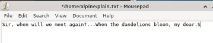
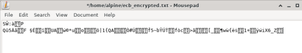
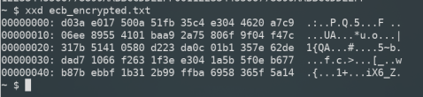

# Lab #2, 22110036, Nguyen Hoang Huy, INSE331280E_01FIE
# Task 1: Transfer files between computers  
**Question 1**: 
Conduct transfering a single plaintext file between 2 computers, 
Using openssl to implementing measures manually to ensure file integerity and authenticity at sending side, 
then veryfing at receiving side. 

**Answer 1**:
## 1. Create a text file named `plain.txt`:
*First, we write a message and save it in a text file:*<br>

```sh
echo "Sir, when will we meet again?...When the dandelions bloom, my dear." > plain.txt
```



Verify current folder for newly created file

## 2. Encrypt the file using AES-256 in ECB mode:

```sh
openssl enc -aes-256-ecb -nosalt -in plain.txt -out ecb_encrypted.txt -K 00112233445566778899AABBCCDDEEFF00112233445566778899AABBCCDDEEFF
``` 



Cyphertext can clearly be seen in the screenshot.

## 3. View the encrypted file using `xxd`:

```sh
xxd ecb_encrypted.txt
```

<br>



Hex bytes of encrypted file can clearly be seen in the screenshot.

## 3. Create hash of encrypted file

```
openssl dgst -sha256 -binary ecb_encrypted.txt > ecb_encrypted.hash

```
## 4. Sign hash by RSA key 

- Create RSA key

```sh
openssl genpkey -algorithm RSA -out private.pem -pkeyopt rsa_keygen_bits:2048
```

- Public key

```sh
openssl rsa -in private.pem -pubout -out public.pem
```

- Sign hash
```
openssl pkeyutl -sign -in ecb_encrypted.hash -inkey private.pem -out ecb_encrypted.signature
```

## 5. Send file to windows computer
```sh
scp ecb_encrypted.txt ecb_encrypted.signature public.pem kiet@192.168.115.1:"C:/Users/Kiet/Documents/huy"

```
- Files need to send:
    - ecb_encrypted.txt (encrypted file)
    - ecb_encrypted.signature (signature)
    - public.pem (public key)
- Windows Computer information (computer receive file):
    - user: kiet
    - ip: 192.168.115.1
    - folder "C:/Users/Kiet/Documents/huy"

## 6. Validate hash và signature:
```
openssl dgst -sha256 ecb_encrypted.txt > received.hash
```
create hash from encrypted file this computer have received 
```
o	openssl pkeyutl -verify -in received.hash -sigfile ecb_encrypted.signature -pubin -inkey public.pem
```
Validate signature:

If output is:
**Signature Verified Successfully**, this encrypted file is validated.

## 7. Decrypte file ecb_encrypted.txt by AES-256-ECB:
```
openssl enc -d -aes-256-ecb -in ecb_encrypted.txt -out decrypted.txt -K 00112233445566778899AABBCCDDEEFF00112233445566778899AABBCCDDEEFF
```
Use AES key 00112233445566778899AABBCCDDEEFF00112233445566778899AABBCCDDEEFF
## 8. Check the content of decrypted file:
```
cat decrypted.txt
```
File 's content is:
- Sir, when will we meet again?...When the dandelions bloom, my dear.


# Task 2: Transfering encrypted file and decrypt it with hybrid encryption. 
**Question 1**:
Conduct transfering a file (deliberately choosen by you) between 2 computers. 
The file is symmetrically encrypted/decrypted by exchanging secret key which is encrypted using RSA. 
All steps are made manually with openssl at the terminal of each computer.

**Answer 1**:


# Task 3: Firewall configuration
**Question 1**:
From VMs of previous tasks, install iptables and configure one of the 2 VMs as a web and ssh server. Demonstrate your ability to block/unblock http, icmp, ssh requests from the other host.

**Answer 1**:

## 1. Set default policies 
```
iptables -P INPUT ACCEPT
iptables -P FORWARD ACCEPT
iptables -P OUTPUT ACCEPT
```
Trong trường hợp muốn cài quyền 
