# Lab #2, 22110036, Nguyen Hoang Huy, INSE331280E_01FIE
# Task 1: Transfer files between computers
**Question 1**:
Conduct transfering a single plaintext file between 2 computers,
Using openssl to implement measures manually to ensure file integrity and authenticity at sending side,
then very finding at receiving side.

**Answer 1**:

## 0. Preparing
- On this lab, I use 2 machines:
 - outsider-10.9.0.5
 - inner-172.16.10.100


**On each machine, install openssh-server**
```
echo "deb http://archive.ubuntu.com/ubuntu/ focal main restricted universe multiverse" > /etc/apt/sources.list
```
```
apt-get update
```
- Download openssh
```
apt-get install openssh-server
```
- Start running ssh
```
service ssh start
```
**On receive files machine, create folder to receive files.**
```
mkdir bdata
```
- View user exam permissions for /bdata folder
```
ls -ld /bdata
```
- Add write permissions for user exam to folder /bdata:
```
chown exam:exam /bdata
chmod 755 /bdata
```

## 1. Create a text file named `plain.txt`:
*First, we write a message and save it in a text file:*<br>

```sh
echo "Sir, when will we meet again?...When the dandelions bloom, my dear." > plain.txt
```

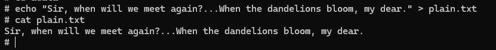

Verify current folder for newly created file

## 2. Generate a hash of the original plaintext file to ensure its integrity (using SHA-256):
```sh
openssl dgst -sha256 -binary plain.txt > plain.hash
```

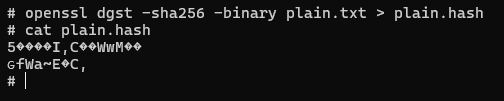

- Generate and check the hash in file plain.hash

## 3. Sign the hash using an RSA private key to ensure authenticity:
- Generate the RSA private key
```sh
openssl genpkey -algorithm RSA -out private.pem -pkeyopt rsa_keygen_bits:2048
```


- Generate the public key
```
openssl rsa -in private.pem -pubout -out public.pem
```
- Sign the hash
```
openssl pkeyutl -sign -in plain.hash -inkey private.pem -out plain.signature
```

## 4. Transfer the plaintext file, its signature, and the public key using SCP:
```
scp plain.txt plain.signature public.pem exam@172.16.10.100:/bdata
```
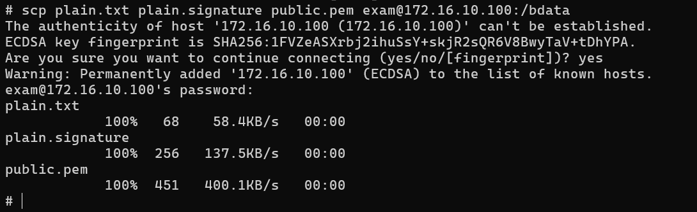

*On receive files machine*

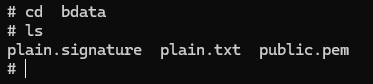

## 5. Verify the file's integrity and the signature on the receiving side:
- Generate the hash from the received file
```
openssl dgst -sha256 -binary plain.txt > received.hash
```
- Verify the signature using the public key:
```
openssl pkeyutl -verify -in received.hash -sigfile plain.signature -pubin -inkey public.pem
```

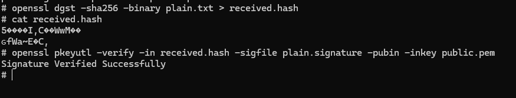

Validate signature:

If output is **Signature Verified Successfully**, this encrypted file is validated.

## 6. Check the content of decrypted file:
```
cat plain.txt
```


File 's content is as expected:
- Sir, when will we meet again?...When the dandelions bloom, my dear.


# Task 2: Transfering encrypted file and decrypt it with hybrid encryption.
**Question 1**:
Conduct transfering a file (deliberately choosen by you) between 2 computers.
The file is symmetrically encrypted/decrypted by exchanging secret key which is encrypted using RSA.
All steps are made manually with openssl at the terminal of each computer.

**Answer 1**:
## 1. Create a text file named `plain.txt`:
*First, we write a message and save it in a text file:*<br>

```sh
echo "Sir, when will we meet again?...When the dandelions bloom, my dear." > plain.txt
```


Verify current folder for newly created file

## 2. Encrypt the file using AES-256 in ECB mode:

```sh
openssl enc -aes-256-ecb -nosalt -in plain.txt -out ecb_encrypted.txt -K 00112233445566778899AABBCCDDEEFF00112233445566778899AABBCCDDEEFF
```

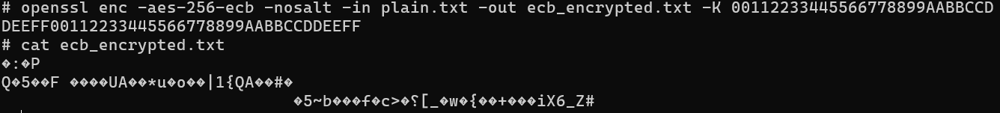

Cyphertext can clearly be seen in the screenshot.

## 3. Create hash of encrypted file by SHA256

```
openssl dgst -sha256 -binary ecb_encrypted.txt > ecb_encrypted.hash

```
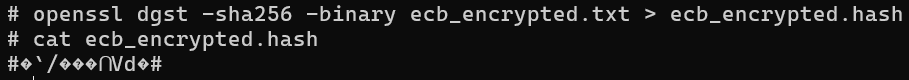

## 4. Sign hash by RSA key

- Create RSA key

```sh
openssl genpkey -algorithm RSA -out private.pem -pkeyopt rsa_keygen_bits:2048
```

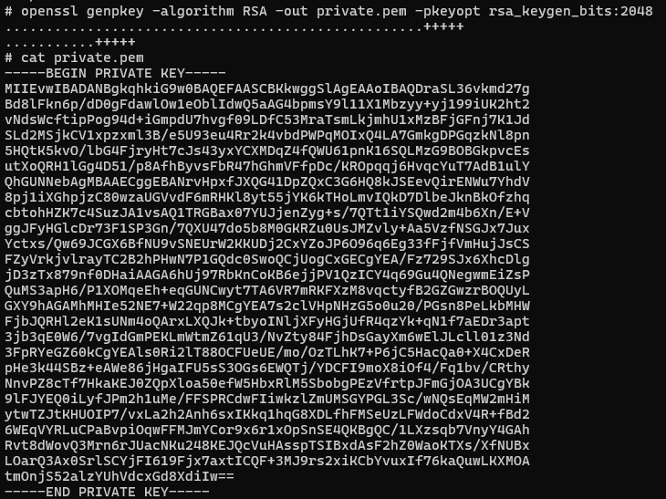

- Public key

```sh
openssl rsa -in private.pem -pubout -out public.pem
```

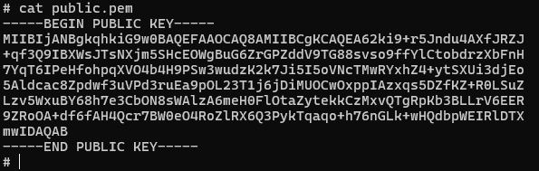

- Sign hash
```
openssl pkeyutl -sign -in ecb_encrypted.hash -inkey private.pem -out ecb_encrypted.signature
```
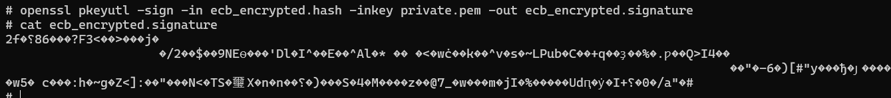

## 5. Send file to inner machine
```sh
scp ecb_encrypted.txt ecb_encrypted.signature public.pem exam@172.16.10.100:/bdata
```

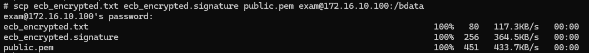

- Files needed to send:
    - ecb_encrypted.txt (encrypted file)
    - ecb_encrypted.signature (signature)
    - public.pem (public key)
- inner machine information (computer receive file):
    - user: exam
    - ip: 172.16.10.100
    - folder /bdata

## 6. On reveice files machine, verify files by hash and signature:

```
openssl dgst -sha256 -binary ecb_encrypted.txt > received.hash
```
- Create hash from encrypted file this computer has received
```
openssl pkeyutl -verify -in received.hash -sigfile ecb_encrypted.signature -pubin -inkey public.pem
```
- Validate signature: If output is **Signature Verified Successfully**, this encrypted file is validated.


## 7. Decrypt file ecb_encrypted.txt by AES-256-ECB:
```
openssl enc -d -aes-256-ecb -in ecb_encrypted.txt -out decrypted.txt -K 00112233445566778899AABBCCDDEEFF00112233445566778899AABBCCDDEEFF
```

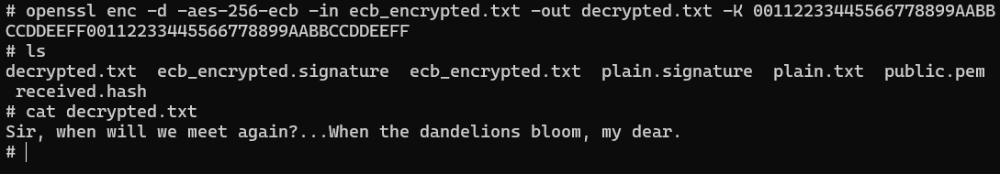

Use AES key 00112233445566778899AABBCCDDEEFF00112233445566778899AABBCCDDEEFF
## 8. Check the content of decrypted file:
```
cat decrypted.txt
```


File 's content is as expected:
- Sir, when will we meet again?...When the dandelions bloom, my dear.


# Task 3: Firewall configuration
**Question 1**:
From VMs of previous tasks, install iptables and configure one of the 2 VMs as a web and ssh server. Demonstrate your ability to block/unblock http, icmp, ssh requests from the other host.

**Answer 1**:

## 0. Prepare
- On this lab, I use 2 machines:
 - outsider-10.9.0.5
 - inner-172.16.10.100


***On inner machine***
```
apt-get install apache2 openssh-server
```
- Configure inner machine as a web and ssh server;


```
service apache2 start
```
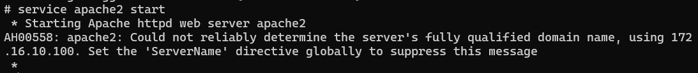

- Start the Apache server.

```
sudo service ssh start
```
 - Start the SSH server.

***On outsider machine***
```
ssh exam@172.16.10.100
```

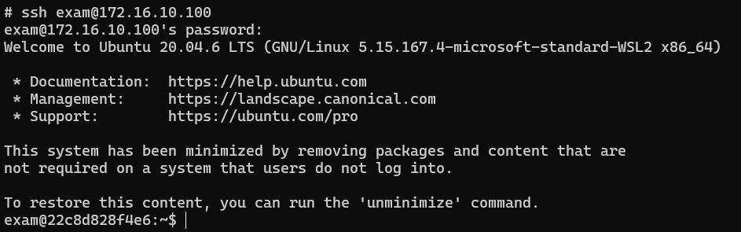

- Test SSH by trying to SSH to the **inner** machine from the **outsider** machine

## 1. Install iptables

```
apt-get install iptables
```
- Install iptables on both machines

```
iptables -L -v -n
```
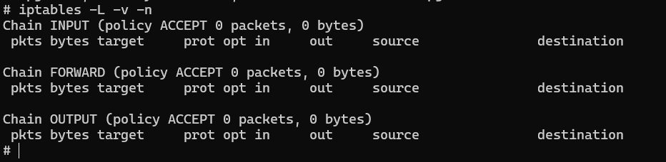

- List all rules of iptables

## 2. Configure iptables

### **a. Block HTTP (port 80)**

***On inner machine***
```
iptables -A INPUT -p tcp --dport 80 -j DROP
```
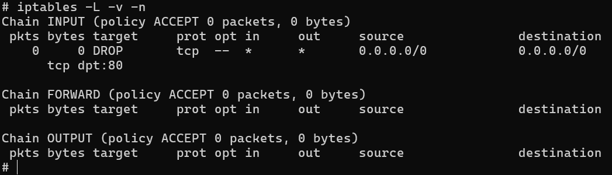

- Add rule successfully, block http with port 80.

***On outsider machine***
```
curl http://172.16.10.100
```


- Can not curl anything because it has blocked.

### **b. Unblock HTTP (port 80)**

***On inner machine***
```
iptables -D INPUT -p tcp --dport 80 -j DROP
```
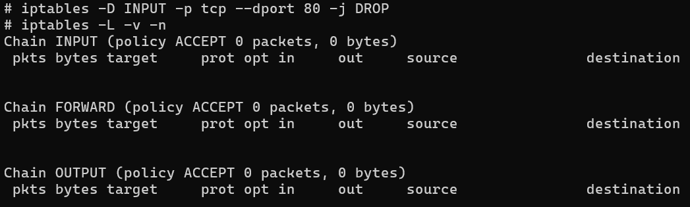

- Drop rule successfully.

***On outsider machine***
```
curl http://172.16.10.100
```
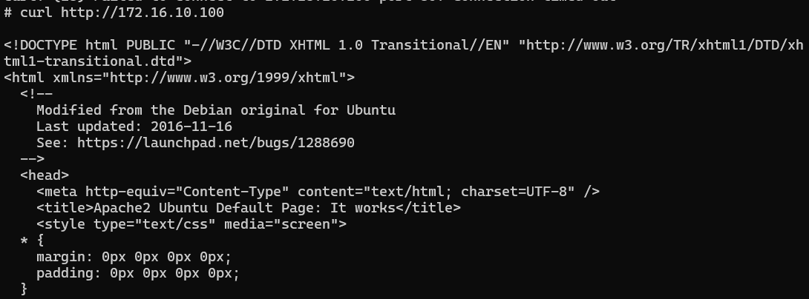

- Can curl html file from inner web server.


### **c. Block ICMP (ping)**

***On inner machine***
```
iptables -A INPUT -p icmp -j DROP
```
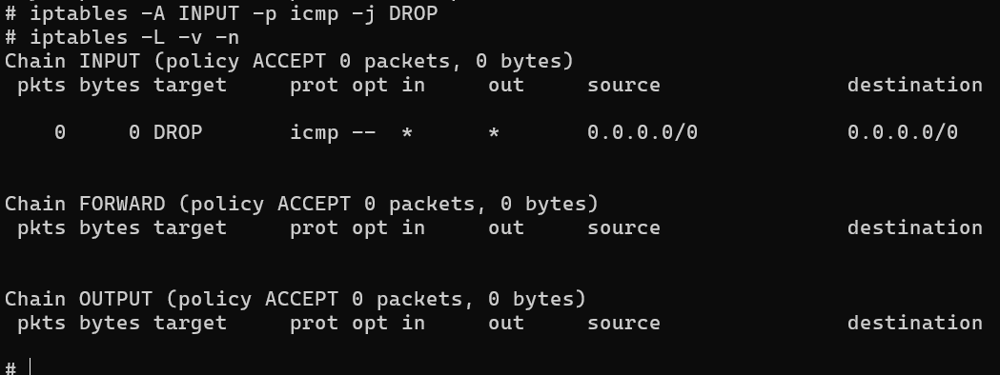

- Add rule successfully, block ICMP.

***On outsider machine***
```
ping 172.16.10.100
```
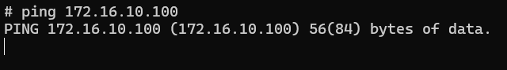

- Can not ping to inner machine, because it has blocked.

### **d. Unblock ICMP (ping)**

***On inner machine***
```
iptables -D INPUT -p icmp -j DROP
```
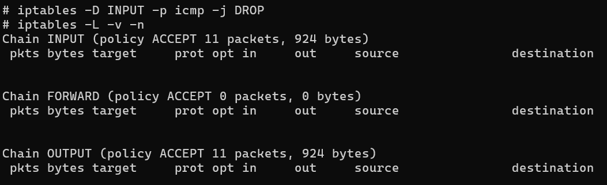

- Drop rule successfully.

***On outsider machine***
```
ping 172.16.10.100
```
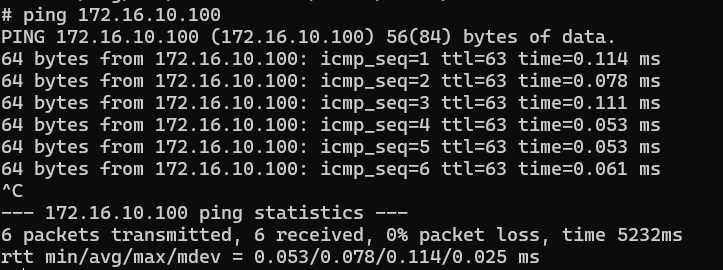

- Can ping to inner machine, 0% packet loss.

### **e. Block SSH (port 22)**

***On inner machine***
```
iptables -A INPUT -p tcp --dport 22 -j DROP
```
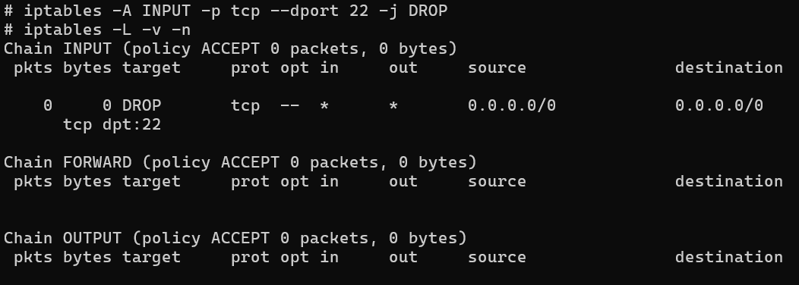

- Add rule successfully, block SSH with port 22.

***On outsider machine***
```
ssh exam@172.16.10.100
```


- Can not SSH to inner machine, because it has blocked.

### **f. Unblock ICMP (ping)**

***On inner machine***
```
iptables -D INPUT -p tcp --dport 22 -j DROP
```
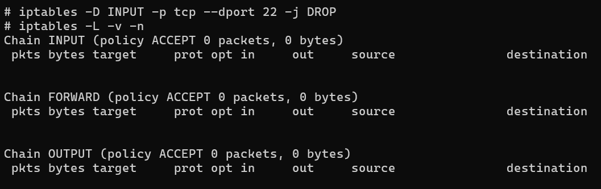

- Drop rule successfully.

***On outsider machine***
```
ssh exam@172.16.10.100
```
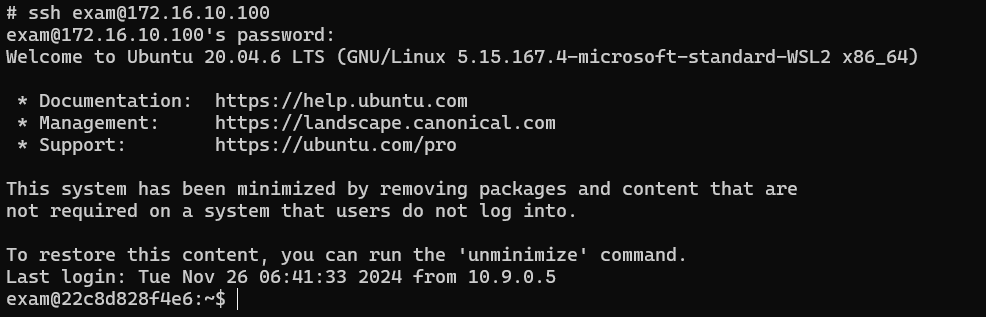

- Can SSH to inner machine, SSH successfully.